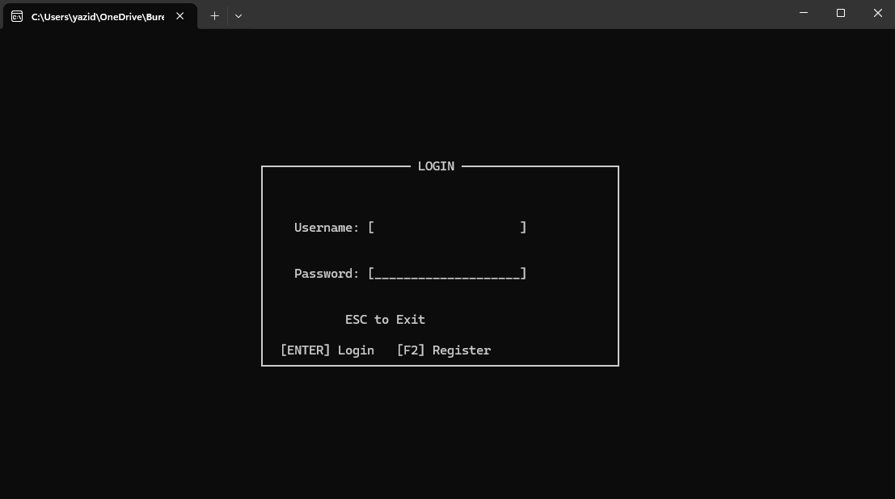
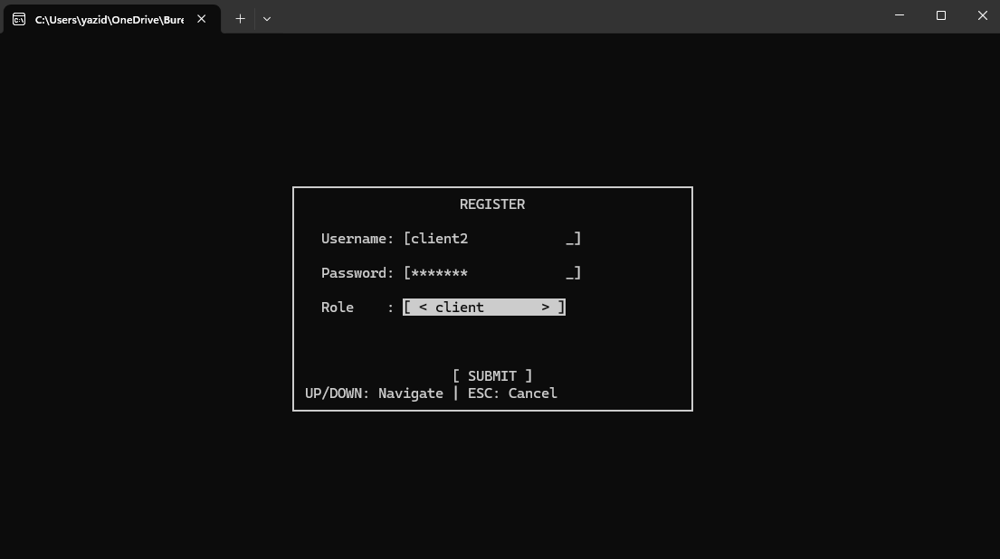
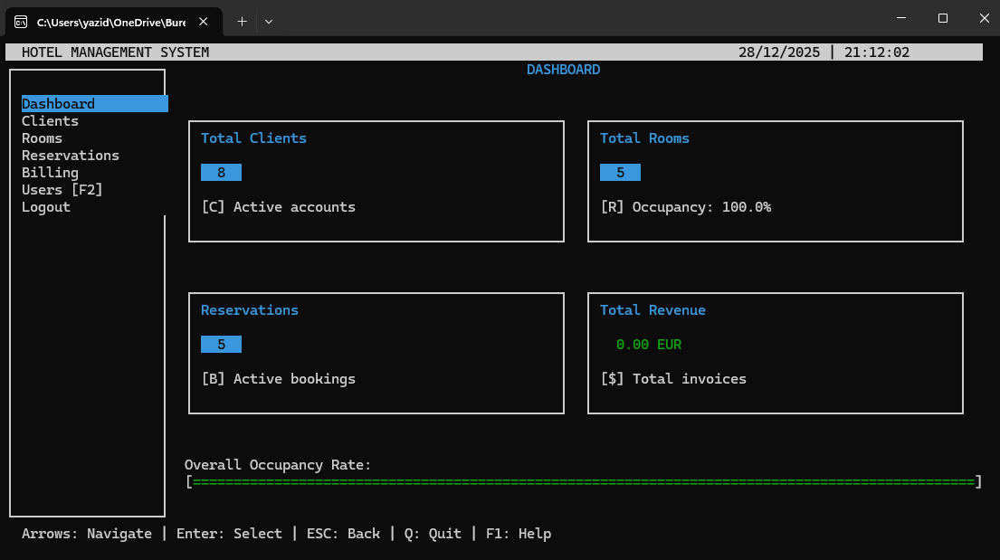
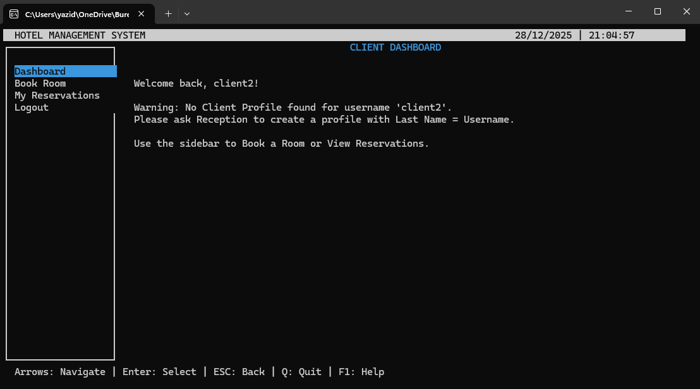
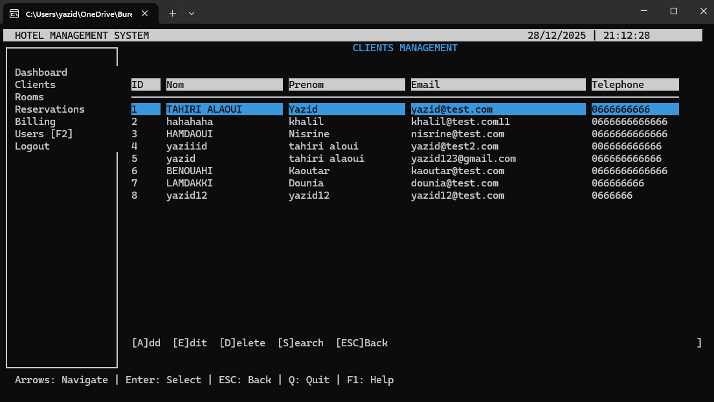
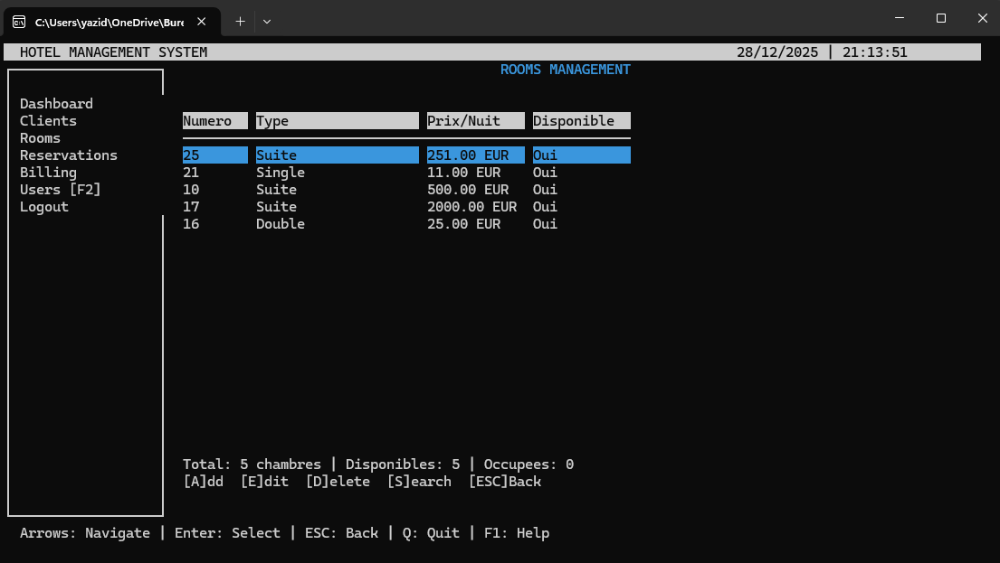
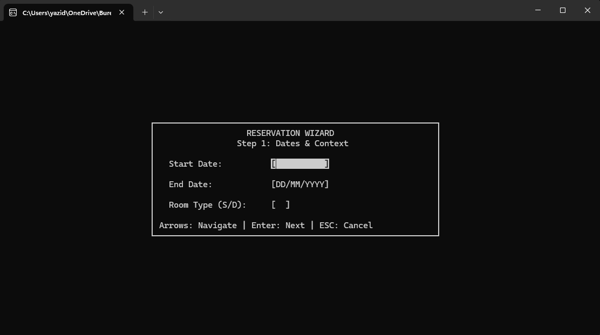
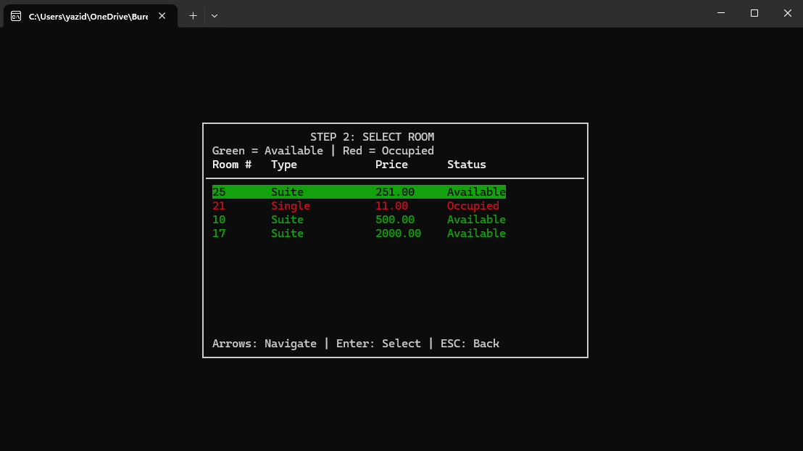
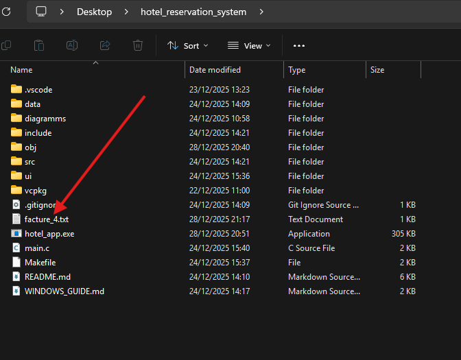

# 🏨 Hotel Reservation Management System

<div align="center">


**A professional, feature-rich hotel management system built with C and ncurses**

[Features](#-features) • [Architecture](#-architecture) • [Installation](#-installation) • [Usage](#-usage) • [Documentation](#-documentation)

</div>

---

## 📋 Table of Contents

- [Overview](#-overview)
- [Key Features](#-features)
- [System Architecture](#-architecture)
- [Tech Stack](#-tech-stack)
- [Installation](#-installation)
- [Usage Guide](#-usage-guide)
- [Project Structure](#-project-structure)
- [Screenshots](#-screenshots)
- [Data Models](#-data-models)
- [Security](#-security)
- [Testing](#-testing)
- [Future Enhancements](#-future-enhancements)
- [Contributors](#-contributors)
- [License](#-license)

---

## 🌟 Overview

The **Hotel Reservation Management System** is a comprehensive, production-ready application designed to streamline hotel operations through automation and efficient data management. Built entirely in C with a professional ncurses-based TUI (Text User Interface), this system demonstrates advanced programming concepts while delivering practical functionality for real-world hotel management.

### 🎯 Project Goals

- **Functional**: Provide a complete hotel management solution with client management, room inventory, reservations, and automated billing
- **Technical**: Demonstrate mastery of advanced C programming concepts including dynamic memory management, file I/O, modular architecture, and ncurses UI development
- **Professional**: Deliver a user experience comparable to commercial solutions while maintaining lightweight performance

### 🏫 Academic Context

- **Institution**: École Nationale des Sciences Appliquées d'Al Hoceima (ENSAH)
- **Program**: 1st Year - Data Engineering (ID1)
- **Course**: Advanced Data Structures and Algorithms
- **Academic Year**: 2024-2025
- **Supervisor**: Dr. BAHRI Abdelkhalek

---

## ✨ Features

### 🔐 Role-Based Access Control (RBAC)

The system implements a comprehensive three-tier access controlmodel:

| Role | Privileges |
|------|-----------|
| **Administrator** | Full system access: user management, client/room/reservation CRUD, billing, system configuration |
| **Receptionist** | Operational access: client management, reservations, billing (no user/system management) |
| **Client** | Self-service portal: view room availability, manage personal reservations |

### 📊 Core Modules

#### 👥 Client Management
- Complete CRUD operations for client profiles
- Advanced search capabilities (by name, ID, email)
- Data validation and duplicate detection
- Automatic ID generation

#### 🛏️ Room Inventory Management
- Room types: Single, Double, Suite
- Dynamic pricing per room
- Real-time availability tracking
- Inventory expansion capabilities

#### 📅 Reservation System
- Intelligent availability checking with conflict detection
- Date validation (no past dates, start < end)
- Automated pricing calculation based on number of nights
- Reservation status management (ACTIVE, CANCELLED)
- Soft delete for historical tracking

#### 💰 Automated Billing
- Automatic invoice generation from reservations
- Precise night calculation using `mktime()` and `difftime()`
- Multi-source data aggregation (clients, rooms, reservations)
- Export to text files for archiving
- Professional invoice formatting

### 💻 User Interface

- **Professional ncurses TUI**: Rich text-based interface with color schemes
- **Intuitive Navigation**: Keyboard shortcuts and guided workflows
- **Wizard-Style Forms**: Step-by-step user guidance
- **Real-time Validation**: Immediate feedback on input
- **Responsive Design**: Adapts to terminal size
- **Color-Coded Status**: Visual indicators for availability, validation states

---

## 🏗️ Architecture

### Three-Tier Layered Architecture

```
┌─────────────────────────────────────────┐
│     Presentation Layer (UI)             │
│  - ncurses interface                    │
│  - Event handling                       │
│  - Theme management                     │
└─────────────────────────────────────────┘
                  ↓
┌─────────────────────────────────────────┐
│     Business Logic Layer                │
│  - Client management                    │
│  - Room inventory                       │
│  - Reservation system                   │
│  - Billing engine                       │
│  - Authentication & RBAC                │
└─────────────────────────────────────────┘
                  ↓
┌─────────────────────────────────────────┐
│     Data Persistence Layer              │
│  - Binary file storage                  │
│  - clients.dat, rooms.dat               │
│  - reservations.dat, invoices.dat       │
│  - users.dat                            │
└─────────────────────────────────────────┘
```

### Data Flow & Relationships

```
┌─────────┐       1:N        ┌──────────────┐       N:1       ┌─────────┐
│ Client  │ ────────────────▶│ Reservation  │◀──────────────── │  Room   │
│         │                  │              │                  │         │
└─────────┘                  └──────────────┘                  └─────────┘
                                    │
                                    │ 1:1
                                    ↓
                             ┌──────────────┐
                             │   Invoice    │
                             │              │
                             └──────────────┘
```

---

## 🛠️ Tech Stack

### Core Technologies

- **Language**: C (ISO C11)
- **UI Library**: ncurses/ncursesw (wide character support)
- **Build System**: GNU Make
- **Platform**: Cross-platform (Windows via MSYS2/Cygwin, Linux, macOS)

### Key Libraries & APIs

- **ncurses**: Terminal UI rendering and event handling
- **time.h**: Date calculations (`mktime`, `difftime`, `strftime`)
- **stdio.h**: Binary file I/O operations
- **stdlib.h**: Dynamic memory management
- **string.h**: String manipulation and validation

### Development Tools

- **Compiler**: GCC with `-Wall -Wextra` strict warnings
- **Version Control**: Git
- **Documentation**: LaTeX for technical report

---

## 📥 Installation

### Prerequisites

#### Windows
```powershell
# Install MSYS2 or Cygwin for ncurses support
# Using MSYS2:
pacman -S mingw-w64-x86_64-gcc
pacman -S mingw-w64-x86_64-ncurses
```

#### Linux (Debian/Ubuntu)
```bash
sudo apt-get update
sudo apt-get install build-essential
sudo apt-get install libncurses5-dev libncursesw5-dev
```

#### macOS
```bash
# Xcode Command Line Tools
xcode-select --install

# ncurses (usually pre-installed)
brew install ncurses
```

### Build Instructions

1. **Clone the repository**
```bash
git clone https://github.com/SatushiNakamot0/rapport-Structure-de-Donn-es-et-Algorithmique-avanc-es-.git
cd rapport-Structure-de-Donn-es-et-Algorithmique-avanc-es-
```

2. **Compile the project**
```bash
make
```

3. **Run the application**
```bash
./hotel_app.exe    # Windows
./hotel_app        # Linux/macOS
```

4. **Clean build artifacts**
```bash
make clean
```

### Makefile Configuration

```makefile
CC = gcc
CFLAGS = -Wall -Wextra -Iinclude
LDFLAGS = -lncursesw

SOURCES = $(wildcard src/*.c ui/*.c)
OBJECTS = $(SOURCES:.c=.o)

hotel_app.exe: $(OBJECTS) main.o
    $(CC) $(CFLAGS) -o $@ $^ $(LDFLAGS)

clean:
    rm -f $(OBJECTS) main.o hotel_app.exe
```

---

## 📖 Usage Guide

### First Launch

1. **Initial Setup**: The system creates the `data/` directory and initializes binary files on first run
2. **Default Credentials**:
   - **Admin**: `username: admin` / `password: admin`
   - Register new users via the registration screen (F2 from login)

### Authentication Flow

```
Login Screen → Credentials Validation → Role Detection → Dashboard Routing
                      ↓                        ↓
                   Error                  Admin/Receptionist/Client
                   Message                Specific Dashboard
```

### Common Workflows

#### Creating a Reservation (Receptionist)

1. Navigate to **Reservations Management**
2. Press **[A]dd** to start reservation wizard
3. **Step 1**: Enter check-in date, check-out date, room type
4. **Step 2**: Select available room from color-coded list
5. **Step 3**: Link to client (enter ID or search with F)
6. **Confirm**: System calculates total and creates reservation

#### Generating an Invoice (Admin/Receptionist)

1. Navigate to **Billing & Invoices**
2. Press **[C]reate** invoice
3. Enter reservation ID
4. System auto-generates invoice with:
   - Client details
   - Room information
   - Night count calculation: `(End Date - Start Date)`
   - Total: `Nights × Price per Night`
5. Press **[P]** to export to `facture_N.txt`

#### Client Self-Service Portal

1. Login with client credentials
2. View **My Reservations** dashboard
3. **Browse & Book Rooms**:
   - View available rooms
   - Select room and dates
   - Confirm booking (subject to receptionist approval)

### Keyboard Shortcuts

| Key | Action |
|-----|--------|
| `↑` `↓` | Navigate lists |
| `Tab` / `Shift+Tab` | Navigate form fields |
| `Enter` | Confirm selection |
| `ESC` | Go back / Cancel |
| `F2` | Register (from login screen) |
| `F` | Search client (in link wizard) |
| `[A]` | Add new entry |
| `[E]` | Edit selected entry |
| `[D]` | Delete selected entry |
| `[S]` | Search |
| `[P]` | Print/Export |

---

## 📁 Project Structure

```
hotel_reservation_system/
│
├── src/                      # Business logic layer
│   ├── clients.c             # Client CRUD operations
│   ├── chambres.c            # Room inventory management
│   ├── reservations.c        # Reservation system
│   ├── fichiers.c            # File I/O operations
│   ├── auth.c                # Authentication & RBAC
│   ├── data_init.c           # Database initialization
│   └── billing.c             # Invoice generation
│
├── ui/                       # Presentation layer
│   ├── ui.c                  # Main UI controller
│   ├── ui_draw.c             # Drawing utilities
│   ├── ui_theme.c            # Color schemes
│   ├── ui_login.c            # Login/Register screens
│   ├── ui_dashboard.c        # Dashboard views
│   ├── ui_clients.c          # Client management UI
│   ├── ui_rooms.c            # Room management UI
│   ├── ui_reservations.c     # Reservation UI
│   ├── ui_billing.c          # Billing UI
│   └── ui_client_portal.c    # Client self-service portal
│
├── include/                  # Header files
│   ├── structures.h          # Data structures
│   ├── clients.h
│   ├── chambres.h
│   ├── reservations.h
│   ├── fichiers.h
│   ├── auth.h
│   ├── ui.h
│   └── constants.h
│
├── data/                     # Data persistence (auto-generated)
│   ├── clients.dat           # Binary client records
│   ├── chambres.dat          # Binary room records
│   ├── reservations.dat      # Binary reservation records
│   ├── factures.dat          # Binary invoice records
│   └── users.dat             # Binary user authentication
│
├── main.c                    # Application entry point
├── Makefile                  # Build configuration
└── README.md                 # This file
```

---

## 📸 Screenshots

### Authentication System

<table>
  <tr>
    <td align="center">
      
      <br />
      <b>Login Screen</b>
      <br />
      Professional authentication with masked password
    </td>
    <td align="center">
      
      <br />
      <b>User Registration</b>
      <br />
      Role selection and account creation
    </td>
  </tr>
</table>

### Dashboards

<table>
  <tr>
    <td align="center">
      
      <br />
      <b>Administrator Dashboard</b>
      <br />
      Metrics: Clients, Rooms, Occupancy, Revenue
    </td>
    <td align="center">
      
      <br />
      <b>Client Portal</b>
      <br />
      Self-service reservation management
    </td>
  </tr>
</table>

### Management Interfaces

<table>
  <tr>
    <td align="center">
      
      <br />
      <b>Client Management</b>
      <br />
      Full CRUD with search capabilities
    </td>
    <td align="center">
      
      <br />
      <b>Room Inventory</b>
      <br />
      Real-time availability tracking
    </td>
  </tr>
</table>

### Reservation System

<table>
  <tr>
    <td align="center">
      
      <br />
      <b>Reservation Wizard - Step 1</b>
      <br />
      Date selection and validation
    </td>
    <td align="center">
      
      <br />
      <b>Reservation Wizard - Step 2</b>
      <br />
      Color-coded availability (Green/Red)
    </td>
  </tr>
</table>

### Billing System

<table>
  <tr>
    <td align="center">
      
      <br />
      <b>Invoice Details</b>
      <br />
      Automated calculation and formatting
    </td>
    <td align="center">
      
      <br />
      <b>Invoice Export</b>
      <br />
      Text file generation for archiving
    </td>
  </tr>
</table>

---

## 🗄️ Data Models

### Client Structure

```c
typedef struct {
    int id;                  // Auto-generated unique identifier
    char nom[50];            // Last name
    char prenom[50];         // First name
    char email[100];         // Email (unique, validated)
    char telephone[20];      // Phone number
} Client;
```

### Room Structure

```c
typedef struct {
    int numero;              // Room number (unique)
    char type[20];           // Type: "Single", "Double", "Suite"
    float prix;              // Price per night
    int disponible;          // Availability flag (1=available, 0=occupied)
} Chambre;
```

### Reservation Structure

```c
typedef struct {
    int id;                  // Auto-generated reservation ID
    int client_id;           // Foreign key to Client
    int chambre_numero;      // Foreign key to Room
    char date_debut[11];     // Check-in date (YYYY-MM-DD)
    char date_fin[11];       // Check-out date (YYYY-MM-DD)
    float montant;           // Total amount
    char statut[20];         // Status: "ACTIVE", "CANCELLED"
} Reservation;
```

### Invoice Structure

```c
typedef struct {
    int idFacture;           // Auto-generated invoice ID
    int idClient;            // Foreign key to Client
    int nbNuits;             // Number of nights
    float prixNuit;          // Price per night
    float total;             // Total = nbNuits × prixNuit
} Facture;
```

### User Structure

```c
typedef struct {
    char username[50];       // Unique username
    char password[64];       // Hashed password (future: bcrypt)
    char role[20];           // Role: "admin", "receptionist", "client"
} User;
```

---

## 🔒 Security

### Current Implementation

- **Access Control**: Role-Based Access Control (RBAC) with three privilege levels
- **Session Management**: User context maintained throughout session
- **Data Validation**: Input sanitization and format validation
- **File Permissions**: Binary files stored with restricted access

### Planned Enhancements

- [ ] Password hashing with bcrypt/Argon2
- [ ] Audit logging for all operations
- [ ] Session timeout mechanisms
- [ ] SQL injection prevention (future SQLite migration)
- [ ] Encrypted data storage

---

## ✅ Testing

### Validated Test Scenarios

| Scenario | Description | Status |
|----------|-------------|--------|
| Admin Authentication | Login with valid credentials | ✅ Pass |
| User Registration | Complete registration form | ✅ Pass |
| Client Addition | Manual client profile creation | ✅ Pass |
| Valid Reservation | Dates valid, room available | ✅ Pass |
| Reservation Conflict | Overlapping dates detection | ✅ Pass |
| Client Search | Search by name/ID/email | ✅ Pass |
| Invoice Generation | Auto-calculation from reservation | ✅ Pass |
| Invoice Export | File generation validation | ✅ Pass |
| Client Portal | Self-service access | ✅ Pass |

### Business Rules Validation

- ✅ **Unique Identifiers**: IDs enforced for all entities
- ✅ **Date Formats**: YYYY-MM-DD validation
- ✅ **Email Validation**: Format and uniqueness checks
- ✅ **Temporal Constraints**: No past dates for new reservations
- ✅ **Date Consistency**: Start date < End date
- ✅ **Conflict Detection**: Overlap algorithm prevents double-booking
- ✅ **Precise Calculations**: `mktime()`/`difftime()` for accuracy
- ✅ **Data Persistence**: Binary file integrity across sessions
- ✅ **Referential Integrity**: Valid foreign keys enforced
- ✅ **RBAC Enforcement**: Role privileges respected

---

## 🚀 Future Enhancements

### Functional Improvements

- [ ] **Advanced Analytics**: Occupancy rates, monthly revenue, customer loyalty metrics
- [ ] **Multi-format Export**: PDF generation, CSV reports
- [ ] **Notification System**: Email alerts for upcoming reservations
- [ ] **Staff Management**: Housekeeping assignment, shift scheduling
- [ ] **Dynamic Pricing**: Seasonal rate adjustments, promotional codes
- [ ] **Multi-property Support**: Manage multiple hotel locations

### Technical Upgrades

- [ ] **Database Migration**: Transition to SQLite for scalability
- [ ] **Password Security**: Implement bcrypt hashing
- [ ] **Audit Trails**: Comprehensive operation logging
- [ ] **Unit Testing**: Test coverage with CUnit/Check framework
- [ ] **API Layer**: RESTful API for web/mobile integration
- [ ] **Documentation**: Auto-generation with Doxygen
- [ ] **Internationalization**: Multi-language support (i18n)

### UI/UX Enhancements

- [ ] **GUI Version**: GTK/Qt graphical interface
- [ ] **Web Portal**: Browser-based administration
- [ ] **Mobile App**: iOS/Android companion apps
- [ ] **Themes**: Customizable color schemes
- [ ] **Accessibility**: Screen reader support

---

## 👥 Contributors

This project was developed by **ENSAH ID1 2024/2025** students:

<table>
  <tr>
    <td align="center">
      <b>Yazid TAHRI ALAOUI</b><br/>
      Lead Developer<br/>
      Architecture & Core Systems
    </td>
    <td align="center">
      <b>Dounia LAMDAKKI</b><br/>
      Developer<br/>
      UI/UX & Billing Module
    </td>
    <td align="center">
      <b>Kaoutar BENOUAHI</b><br/>
      Developer<br/>
      Testing & Documentation
    </td>
  </tr>
</table>

### Supervision

**Dr. BAHRI Abdelkhalek**  
*Professor - Advanced Data Structures and Algorithms*  
École Nationale des Sciences Appliquées d'Al Hoceima

---

## 📄 License

This project is licensed under the **MIT License** - see the LICENSE file for details.

```
MIT License

Copyright (c) 2024 ENSAH - ID1 Class

Permission is hereby granted, free of charge, to any person obtaining a copy
of this software and associated documentation files (the "Software"), to deal
in the Software without restriction, including without limitation the rights
to use, copy, modify, merge, publish, distribute, sublicense, and/or sell
copies of the Software, and to permit persons to whom the Software is
furnished to do so, subject to the following conditions:

The above copyright notice and this permission notice shall be included in all
copies or substantial portions of the Software.

THE SOFTWARE IS PROVIDED "AS IS", WITHOUT WARRANTY OF ANY KIND, EXPRESS OR
IMPLIED, INCLUDING BUT NOT LIMITED TO THE WARRANTIES OF MERCHANTABILITY,
FITNESS FOR A PARTICULAR PURPOSE AND NONINFRINGEMENT.
```

---

## 📚 Documentation

For comprehensive technical documentation, including:
- UML diagrams (Use Case, Class, Sequence)
- Detailed algorithm descriptions
- Code architecture deep-dive
- Extended testing reports

Please refer to the full academic report: **[main.pdf](main.pdf)**

---

## 🙏 Acknowledgments

We extend our gratitude to:

- **Dr. BAHRI Abdelkhalek** for his rigorous guidance and expertise in C programming
- **ENSAH Faculty** for providing an excellent learning environment
- **Open Source Community** for ncurses library and development tools
- **Our Families** for unwavering support throughout the project

---

## 📞 Contact & Support

For questions, suggestions, or collaboration opportunities:

- **GitHub Issues**: [Report a bug](https://github.com/SatushiNakamot0/rapport-Structure-de-Donn-es-et-Algorithmique-avanc-es-/issues)
- **Email**: [Contact via ENSAH](mailto:contact@ensah.ma)
- **Institution**: École Nationale des Sciences Appliquées d'Al Hoceima

---

<div align="center">

**⭐ Star this repository if you found it helpful!**

Made with ❤️ by ENSAH ID1 Students | 2024-2025

[Back to Top](#-hotel-reservation-management-system)

</div>
